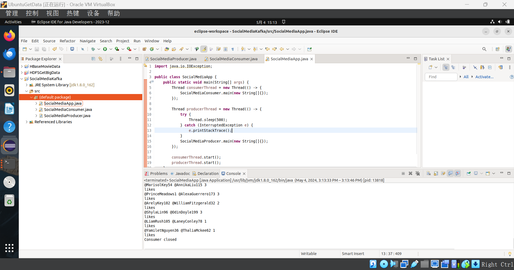

# Kafka-采集数据-Redis存储

[TOC]

## Step1 Kafka安装配置

### 0 Kafka安装

访问Kafka官网下载页面（https://kafka.apache.org/downloads），下载 [kafka_2.13-3.7.0.tgz](https://downloads.apache.org/kafka/3.7.0/kafka_2.13-3.7.0.tgz) 到虚拟机“~/Downloads”目录下。

执行如下命令完成Kafka的安装：

```language-bash
cd ~/Downloads
sudo tar -zxf  kafka_2.13-3.7.0.tgz -C /usr/local
cd /usr/local
sudo mv kafka_2.13-3.7.0 kafka
sudo chown -R hadoop ./kafka
```


### 1 部署Kafka伪分布式集群

进入kafka目录，在此目录下建立一个目录etc，将config文件夹中的zookeeper.properties复制到etc文件目录中。

```language-bash
cd /usr/local/kafka
sudo mkdir etc

cd /usr/local/kafka/config	#先进入kafka的config目录中
ls          #查看config目录下的文件有没有zookeeper.properties
sudo mv zookeeper.properties /usr/local/kafka/etc  #将config文件夹中的zookeeper.properties复制到etc文件目录中
cd /usr/local/kafka/etc      #进入etc目录查看此目录有没有zookeeper.properties文件
ls

```


将config文件夹中的server.properties复制三份至etc文件目录中，分别命名为server-0.properties、server-1.properties、server-2.properties

```language-bash
cd /usr/local/kafka/config    #进入config目录
sudo cp server.properties /usr/local/kafka/etc/server-0.properties 	 #将config文件夹中的server.properties复制第一份到etc并命名server-0.properties
sudo cp server.properties /usr/local/kafka/etc/server-1.properties  #第二份复制命名
sudo cp server.properties /usr/local/kafka/etc/server-2.properties  #第三份复制命名
cd /usr/local/kafka/etc    #进入etc目录查看是否复制成功
ls                 
```


### 2 配置三个server-X.properties文件

分别编辑三个broker配置server-X.properties文件中的以下信息：

```language-bash
broker.id = X  
listeners = PLAINTEXT://:9092(9093,9094)    
log.dirs.=/tmp/kafka-logsX 
```

具体操作命令：

```language-bash
cd /usr/local/kafka/etc
ls    #进入ect界面后查看是否存在server-X.properties文件
sudo vim ../etc/server-0.properties      #编辑server-0.properties文件
sudo vim ../etc/server-1.properties      #编辑server-1.properties文件
sudo vim ../etc/server-2.properties      #编辑server-2.properties文件
```


对于3个伪分布式集群分别进行修改：


### 3 启动zookeeper服务器和kafka集群

首先启动zookeeper：

```language-bash
cd /usr/local/kafka 
./bin/zookeeper-server-start.sh  etc/zookeeper.properties
```


启动kafka集群

```language-bash
cd /usr/local/kafka
./bin/kafka-server-start.sh  etc/server-0.properties   
./bin/kafka-server-start.sh  etc/server-1.properties   #相同路径下，启动新端口操作
./bin/kafka-server-start.sh  etc/server-2.properties   #相同路径下，启动新端口操作
```


启动集群看是否成功

```language-bash
jps
```


启动成功！

注意，启动的zookeeper和3个server都需要保持在启动状态，不能关闭终端。

## Step2 Java API实现数据统计到JSON

### 0 配置Topic

创建3个Topic以完成任务，分别是`comments`, `likes`, 和 `shares`，

```language-bash
cd /usr/local/kafka
./bin/kafka-topics.sh --create --topic comments --partitions 3 --replication-factor 2 --bootstrap-server localhost:9092,localhost:9093,localhost:9094

./bin/kafka-topics.sh --create --topic likes --partitions 3 --replication-factor 2 --bootstrap-server localhost:9092,localhost:9093,localhost:9094

./bin/kafka-topics.sh --create --topic shares --partitions 3 --replication-factor 2 --bootstrap-server localhost:9092,localhost:9093,localhost:9094
```


创建成功！

查看创建的Topics

```language-bash
cd /usr/local/kafka
./bin/kafka-topics.sh --describe --topic comments --bootstrap-server localhost:9092,localhost:9093,localhost:9094
./bin/kafka-topics.sh --describe --topic likes,shares --bootstrap-server localhost:9092,localhost:9093,localhost:9094
```


### 1 项目创建与环境配置

创建java项目，导入相关的jar包：


### 2 Kafka 生产者

创建生产者：

```java
import org.apache.kafka.clients.producer.*;
import java.io.*;
import java.util.Properties;

public class SocialMediaProducer {
    public static void main(String[] args) {
        String inputFile = "/home/hadoop/Downloads/dataset/student_dataset.txt";
        Properties props = new Properties();
        props.put("bootstrap.servers", "localhost:9092,localhost:9093,localhost:9094");
        props.put("key.serializer", "org.apache.kafka.common.serialization.StringSerializer");
        props.put("value.serializer", "org.apache.kafka.common.serialization.StringSerializer");

        Producer<String, String> producer = new KafkaProducer<>(props);

        try (BufferedReader br = new BufferedReader(new FileReader(inputFile))) {
            String line;
            while ((line = br.readLine()) != null) {
                String[] parts = line.split(" ", 2); 
                if (parts.length < 2) {
                    System.err.println("Skipping malformed line: " + line);
                    continue;
                }
                String type = parts[0].toLowerCase();  
                String message = parts[1];

                String topic;
                switch (type) {
                    case "like":
                        topic = "likes";
                        break;
                    case "comment":
                        topic = "comments";
                        break;
                    case "share":
                        topic = "shares";
                        break;
                    default:
                        System.err.println("Unknown type: " + type + " in line: " + line);
                        continue;
                }

                producer.send(new ProducerRecord<>(topic, null, message), new Callback() {
                    @Override
                    public void onCompletion(RecordMetadata metadata, Exception exception) {
                        if (exception != null) {
                            System.err.println("Failed to send message: " + message + " to topic: " + topic);
                            exception.printStackTrace();
                        } else {
                            System.out.println("Sent message: " + message + " to topic: " + topic);
                        }
                    }
                });
            }
        } catch (IOException e) {
            e.printStackTrace();
        } finally {
            producer.close();
        }
    }
}
```

运行生产者发送数据：


### 3 Kafka 消费者

创建消费者，从不同的topic读取数据，并最终输出为json：

```java
import org.apache.kafka.clients.consumer.ConsumerRecord;
import org.apache.kafka.clients.consumer.ConsumerRecords;
import org.apache.kafka.clients.consumer.KafkaConsumer;
import org.apache.kafka.clients.consumer.ConsumerConfig;
import org.apache.kafka.common.serialization.StringDeserializer;

import com.fasterxml.jackson.databind.ObjectMapper;
import com.fasterxml.jackson.databind.node.ObjectNode;

import java.io.FileWriter;
import java.util.*;
import java.util.concurrent.TimeUnit;

public class SocialMediaConsumer {
    private static final ObjectMapper mapper = new ObjectMapper();

    public static void main(String[] args) {
        Properties props = new Properties();
        props.put(ConsumerConfig.BOOTSTRAP_SERVERS_CONFIG, "localhost:9092,localhost:9093,localhost:9094");
        props.put(ConsumerConfig.GROUP_ID_CONFIG, "social-media-group");
        props.put(ConsumerConfig.KEY_DESERIALIZER_CLASS_CONFIG, StringDeserializer.class.getName());
        props.put(ConsumerConfig.VALUE_DESERIALIZER_CLASS_CONFIG, StringDeserializer.class.getName());
        props.put(ConsumerConfig.AUTO_OFFSET_RESET_CONFIG, "earliest");

        KafkaConsumer<String, String> consumer = new KafkaConsumer<>(props);
        consumer.subscribe(Arrays.asList("likes", "comments", "shares"));

        Map<String, Set<String>> userComments = new HashMap<>();
        Map<String, Map<String, Integer>> userLikes = new HashMap<>();
        Map<String, Integer> userPopularity = new HashMap<>();

        final int giveUp = 10000;  // 10 seconds timeout
        int noRecordsCount = 0;

        try {
            while (true) {
                ConsumerRecords<String, String> records = consumer.poll(100);
                if (records.count() == 0) {
                    noRecordsCount += 100; // poll timeout duration
                    if (noRecordsCount > giveUp) break;
                } else {
                    noRecordsCount = 0; // reset timeout counter
                    System.out.println("Received " + records.count() + " records");
                }

                for (ConsumerRecord<String, String> record : records) {
                    processRecord(record, userComments, userLikes, userPopularity);
                }

                if (!records.isEmpty()) {
                	try {
                		writeToJsonFiles(userComments, userLikes, userPopularity);
                    }
                	catch (Exception e) {}
                }
            }
        } finally {
            consumer.close();
            System.out.println("Consumer closed");
        }
    }

    private static void processRecord(ConsumerRecord<String, String> record, Map<String, Set<String>> userComments, Map<String, Map<String, Integer>> userLikes, Map<String, Integer> userPopularity) {
        System.out.println(record.value());
    	String[] parts = record.value().split(" ");
    	

        String topic = record.topic();
        String userWhoPosted = parts[1];
        String postId = parts[2];

        System.out.println(topic);
        
        switch (topic) {
            case "likes":
                userLikes.computeIfAbsent(userWhoPosted, k -> new HashMap<>())
                         .put(postId, userLikes.getOrDefault(userWhoPosted, new HashMap<>()).getOrDefault(postId, 0) + 1);
                userPopularity.merge(userWhoPosted, 1, Integer::sum);
                break;
            case "comments":
                String comment = parts[3];
                userComments.computeIfAbsent(userWhoPosted, k -> new HashSet<>()).add(comment);
                userPopularity.merge(userWhoPosted, 5, Integer::sum);
                break;
            case "shares":
                int shareCount = parts.length - 3;
                userPopularity.merge(userWhoPosted, 20 * shareCount, Integer::sum);
                break;
        }
    }

    private static void writeToJsonFiles(Map<String, Set<String>> userComments, Map<String, Map<String, Integer>> userLikes, Map<String, Integer> userPopularity) throws Exception {
        try (FileWriter commentsWriter = new FileWriter("comments.json");
             FileWriter likesWriter = new FileWriter("likes.json");
             FileWriter popularityWriter = new FileWriter("popularity.json")) {

            mapper.writeValue(commentsWriter, userComments);
            mapper.writeValue(likesWriter, userLikes);

            ObjectNode popularityJson = mapper.createObjectNode();
            userPopularity.forEach((user, popularity) -> {
                popularityJson.put(user, popularity / 1000.0);
            });
            mapper.writeValue(popularityWriter, popularityJson);
        }
    }
}

```

### 4 Kadka 程序入口

需要一个程序入口，对于producer和consumer进行先后的调用：

```java
import java.io.IOException;

public class SocialMediaApp {
    public static void main(String[] args) {
        Thread consumerThread = new Thread(() -> {
        	SocialMediaRedisConsumer.main(new String[]{});
        });

        Thread producerThread = new Thread(() -> {
            try {
                Thread.sleep(500);
            } catch (InterruptedException e) {
                e.printStackTrace();
            }
            SocialMediaProducer.main(new String[]{});
        });

        consumerThread.start();
        producerThread.start();
    }
}
```



### 5 运行结果


## Step3 Java API数据统计到Redis

### 0 安装配置Redis数据库

```language-bash
sudo apt-get install redis-server
```


查看redis是否正常启动：

```language-bash
service redis-server status
```


正常启动！已经部署在6379端口上！

### 1 修改consumer

首先，导入redis有关jar包


进一步修改consumer的存储：

```java
import redis.clients.jedis.Jedis;
import org.apache.kafka.clients.consumer.ConsumerRecord;
import org.apache.kafka.clients.consumer.ConsumerRecords;
import org.apache.kafka.clients.consumer.KafkaConsumer;
import org.apache.kafka.clients.consumer.ConsumerConfig;
import org.apache.kafka.common.serialization.StringDeserializer;

import java.util.*;

public class SocialMediaRedisConsumer {
    private static Jedis jedis;

    public static void main(String[] args) {
        jedis = new Jedis("localhost", 6379);
        System.out.println("Connected to Redis");

        Properties props = new Properties();
        props.put(ConsumerConfig.BOOTSTRAP_SERVERS_CONFIG, "localhost:9092,localhost:9093,localhost:9094");
        props.put(ConsumerConfig.GROUP_ID_CONFIG, "social-media-group");
        props.put(ConsumerConfig.KEY_DESERIALIZER_CLASS_CONFIG, StringDeserializer.class.getName());
        props.put(ConsumerConfig.VALUE_DESERIALIZER_CLASS_CONFIG, StringDeserializer.class.getName());
        props.put(ConsumerConfig.AUTO_OFFSET_RESET_CONFIG, "earliest");

        KafkaConsumer<String, String> consumer = new KafkaConsumer<>(props);
        consumer.subscribe(Arrays.asList("likes", "comments", "shares"));

        final int giveUp = 10000; // 10 seconds timeout
        int noRecordsCount = 0;

        try {
            while (true) {
                ConsumerRecords<String, String> records = consumer.poll(100);
                if (records.count() == 0) {
                    noRecordsCount += 100;
                    if (noRecordsCount > giveUp) break;
                } else {
                    noRecordsCount = 0;
                    System.out.println("Received " + records.count() + " records");
                }

                for (ConsumerRecord<String, String> record : records) {
                    processRecord(record);
                }
            }
        } finally {
            consumer.close();
            jedis.close();
            System.out.println("Consumer and Redis client closed");
        }
    }

    private static void processRecord(ConsumerRecord<String, String> record) {
        String[] parts = record.value().split(" ");
        String topic = record.topic();
        String userWhoPosted = parts[1];
        String postId = parts[2];

        switch (topic) {
            case "likes":
                String likesKey = "likes:" + userWhoPosted + ":" + postId;
                jedis.hincrBy(userWhoPosted, postId, 1);
                break;
            case "comments":
                String comment = parts[3];
                jedis.rpush("comments:" + userWhoPosted, comment);
                break;
            case "shares":
                int shareCount = parts.length - 3;
                jedis.incrBy("popularity:" + userWhoPosted, 20 * shareCount);
                break;
        }
    }
}
```

修改程序入口，将调用consumer的入口进行替换。

### 2 运行代码


### 3 Redis-CLI查看运行结果

```language-bash
redis-cli

KEYS *
```

查看结果：


运行成功！